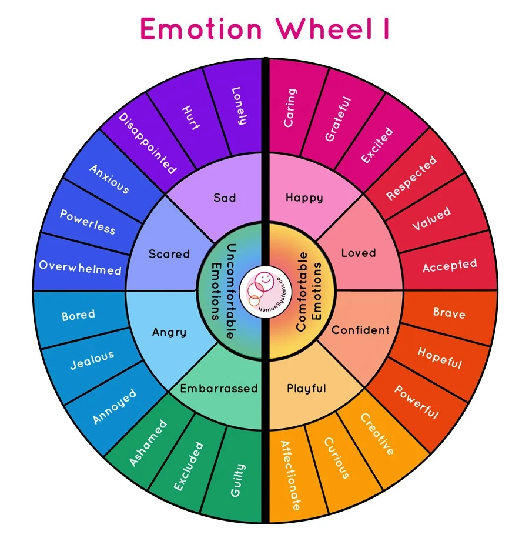
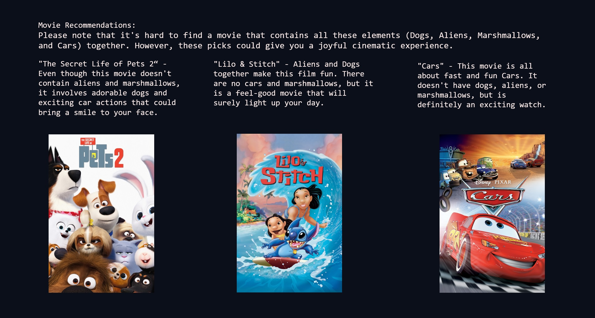

# HappyFlix: Emotion Based Movie Selection  

## MSU AI Bootcamp: Project #3

## HappyFlix Development Team
### Members:

## Description
Our project dives into the realm of human emotion-based movie selection suggestions. Our interface requests the viewer to speak into their microphone to say how their day was, what kind of mood they are in, and what kind of movie they would like to watch. The movie request can include genres, vibes, themes, or specific subjects, such as aliens, brooms, or bananas. The dataset includes summaries and reviews of over 6,000 popular movies from The Movie Database, spanning from January 1970 to April 2024.

## Getting Started

To explore our findings and analysis, follow these steps:

1. **Installation:** Clone this repository to your local machine.
2. **Setup:** Open the cloned repository in Jupyter Notebook, Visual Studio, or Google Colab. Code to access the Gradio page, where you can speak, and receive movie recommendations.
3. **Access**: To utilize many of our notebooks, you will need to obtain API keys from the following sources:
`HuggingFace` `OpenAI` `The Movie Database` 

## Dependencies / Required Packages

- Python 3.10
- Jupyter Notebook
- OpenAI API
- Pandas
- NumPy
- Transformers
- Matplotlib
- Wordcloud
- Stopwords
- Scikit-learn
- Seaborn
- Gradio (Hugging Face)
- Natural Language Toolkit (NLTK)
    - WordNetLemmatizer
    - WordTokenize
    - Stopwords
    - VaderLexicon
    - SentimentIntensityAnalyzer

## Goals / Questions to be addressed
1. Can someone's mood and movie preference be analyzed by AI to suggest the perfect movie for them to watch at a particular time?
2. Can our AI system choose a variety of different movies depending on user input?
3. We want the user to use their voice to explain their mood and movie preferences, and then have our Gradio interface display 3 movie titles, and for each movie:
    - The release year of the movie
    - A short movie overview
    - A review sentiment summary
    - The poster image of the movie

## **Dataset Overview**

[The Movie Database (TMDB) API](https://developer.themoviedb.org/reference/intro/getting-started) 
### We chose the **TMDB API** instead of the **IMDB API**, because 
- The **IMDB API** requires approval that could take up to **45** days to be granted. 
- Upon access, this would allow for a 1-month free subscription, and after that, it is astronomically expensive
### Choosing TMDB, we:
- Over 6,000 popular movies 🎥
- January 1970—April 2024 
- Release dates
- Overviews
- Multiple Review for each movie

### Dataset Explanations

- **Movie ID**: A unique identifying number for each movie.
- **Popularity**: The popularity score is based on the following:
    - Number of votes for the day
    - Number of views for the day
    - Number of users who marked it as a "favorite" for the day
    - Number of users who added it to their "watchlist" for the day
    - Release date 
    - Number of total votes
    - Previous day's score
- **Release Date**
- **Movie Title**
- **Reviews**: The reviews column contains text from all reviews for a particular movie on TMDB. In our cleaned version of the dataset, we ran a sentiment analysis and removed some stopwords.
- **Movie Type / Genre**
The movie genres are as follows. Many of the movies have multiple genres:
`Action`
`Adventure`
`Animation`
`Comedy`
`Crime`
`Documentary`
`Drama`
`Family`
`Fantasy`
`History`
`Horror`
`Music`
`Mystery`
`Romance`
`Science Fiction`
`TV Movie`
`Thriller`
`War`
`Western`
- **Movie Overview**
: A description of the movie's plot. In our cleaned version of the dataset, we ran a sentiment analysis and removed some stopwords.
- **Release Year**
: Since the month and day are not very relevant when it comes to movie selection, we added this column to remove those, keeping the release year.
- **Lemmatized Overviews**
: Movie description overviews that we lemmatized.
- **Adjective Counts**
: Since adjectives are so important when it comes to movie review sentiment analysis, we made a count and list of adjectives in the movie reviews.
- **Lemmatized Reviews**
: We lemmatized words in reviews as part of our cleanup process.
- **Movie Review Sentiment**
: For each movie we determined if the sentiment of the movie reviews were positive overall or negative overall.

## Data Clean-Up
Purged:
- Movie ID number
- Popularity Score
- Release month and day from release date
- Total recommended votes

## Outline of Analytical Process
1. Using Gradio and OpenAI's GPT-4 model, users can record a clip of them speaking, which can then converted to text.
2. The text is then analyzed to determine the user's mood and sentiment.
3. The text is also analyzed to help determine what particular movies the user might like to see.
4. The movie selection is based on a combination of mood analysis, movie preference analysis, and movie review sentiment analysis.
5. The following wheel represents the full list of emotions that we would have liked to include in our emotion sentiment analysis. However, we were not able to find a model through HuggingFace that could perform such refine predictions

## Analysis and Results

1. **Dataset Selection and Modification**
    - We parsed numerous datasets and APIs to find one that not only contained the fields we needed, but 
    was also easily manipulation. After looking at IMDB and Rotten Tomatoes, we settled on The Movie Database which contained movies from 1970 to 2024 in CSV format with genres and extensive user reviews.
    - Using an API key, we
imported the selected CSV file into our project repository.
2. **Cleaning and Refining**
    - Analyze columns to check for null values.
    - Identify and clean columns to ensure consistency.
    - Drop unnecessary columns.
    - Genre id to name mapping
    - Isolate the release year from the full release date
    - Add lemmatized overviews, adjective counts, lemmatized reviews, and movie review sentiment.
4. **Model Implementation**
    - The model selection process was rather tedious. While VADERS could provide sentiment analysis and output positive, negative, and neutral scores. We found a model on HuggingFace that could analyze 6 emotions in our reviews.
    - Model: [Emotion English DistilRoBERTa-base](https://huggingface.co/j-hartmann/emotion-english-distilroberta-base)
    - Emotions this model could detect: `joy` `sadness` `anger` `fear` `disgust` `surprise` `neutral`
5. **Model Optimization**
    - After using the Emotion Detection model above, to further test our dataset, we chose another dataset to download and tested a subset of that.
    - While this provided much better scores, the subset that we needed to use (without a session crash), was much smaller than the set we performed our analysis with
    - This would be challenging to compare with the result of our original analysis.
6. **Model Evaluation**
    - Calculated evaluation metrics to assess the performance of emotion detection model.
    - Accurary scores achieved:
        - Training: **0.78**
        - Validation: **0.747**
        - Testing: **0.733**
    - Heatmap generation
    - Graphing model evaluation
7. **Building of a Gradio Interface**
    - Utilizing Gradio we created a voice recording and automatic speech recognition interface that outputs an audio file to a text file using OpenAI’s whisper-base engine. The output is then analyzed by OpenAI’s ChatGTP 4.0’s “chat.completion” method. The result of this method analysis created two outputs, one identifying the genre preference based on the TMDB categories and the other the emotional state from the Stanford emotional wheel. This output file is then run through the selector program.

## Problems Encountered
- Processing many of the jupyter notebook cells strained our relatively fast CPUs and took many hours to process, even after changing parameters
- Gradio is a bit more challenging when it comes to layout customization when compared to HTML
- The HuggingFace model chosen to perform our analysis could detect 6 emotions from textual data. While this is more than what most models (that we could find)

## Future Considerations
- A link to the actual movie on streaming services as part of the Python output
- A fully integrated seamless HTML system
- Integration of more APIs, such as IMDB and Rotten Tomatoes
- TMDB recently added a user provided emoji-based mood/emotion system foreach movie
    -  However, as of April 2024, this data is not included as part of the API

- If time and resources allow, we could explore further optimization techniques such as:
    - Hyperparameter tuning
    - Experimenting with different architectures
    - Leveraging additional data sources

## Acknowledgments

[The Movie Database](https://www.themoviedb.org/)

